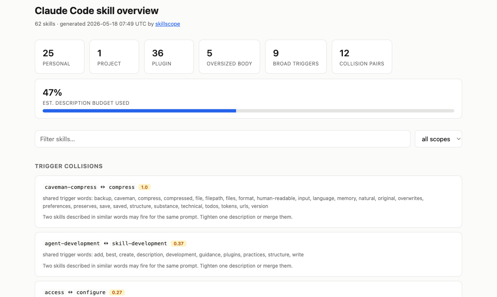

# skillscope

A one-glance overview of your [Claude Code](https://claude.com/claude-code) skills.

`skillscope` scans every `SKILL.md` on your machine — personal, project, and
plugin — and writes a single self-contained HTML report: what each skill does,
what triggers it, how big it is, and what to watch out for.



It answers the questions you actually have once you have more than a handful of
skills installed:

- **What do I even have?** Every skill, grouped by scope, in one page.
- **What fires when?** The trigger phrases pulled out of each description.
- **What's risky?** Oversized bodies, over-broad triggers, and skills whose
  descriptions overlap enough to fire for the same prompt.
- **Am I over budget?** An estimate of how much of the skill-listing context
  budget your descriptions consume.

## Why

Claude Code loads every skill's *description* into context on every message so
it can decide what to trigger. Bodies load only when a skill fires. A pile of
vaguely-described skills doesn't just waste tokens — it causes **trigger
collisions**, where the wrong skill fires or none does. `skillscope` makes that
pile legible so you can keep it small and sharp.

## Install

No dependencies. No install step. Just Python 3.9+.

```bash
git clone https://github.com/Troels-en/skillscope.git
cd skillscope
python3 skillscope.py --open
```

## Usage

```bash
python3 skillscope.py [options]
```

| Option | Default | Description |
|---|---|---|
| `--project DIR` | current dir | Project to scan for `.claude/skills` |
| `--out FILE` | `skill-report.html` | Where to write the HTML report |
| `--json FILE` | — | Also write a machine-readable JSON report |
| `--context-window N` | `200000` | Model context window in tokens, for the budget estimate. Use `1000000` on a 1M-context model. |
| `--open` | off | Open the report in your browser when done |

Example:

```bash
python3 skillscope.py --project ~/my-app --context-window 1000000 --open
```

## What the report shows

- **Summary** — counts by scope, oversized bodies, broad triggers, collision
  pairs, and estimated description-budget usage.
- **Trigger collisions** — pairs of skills with high description overlap,
  scored, with the shared words listed.
- **Per-skill cards** — description, extracted trigger phrases, non-triggers,
  body size, invocation mode (you / Claude / both), and a plain-language note.

Skills are flagged when they:

- have a body over 500 lines (the official size guideline),
- have a description + `when_to_use` over 1,536 characters (the listing cap),
- use broad wording (`any`, `every`, `always`, `must use`, …) that makes them
  fire on unrelated prompts,
- have no description at all.

## Privacy

`skillscope` only reads `SKILL.md` files on your machine and writes a local HTML
file. Nothing is sent anywhere. No network calls. No API key. No LLM.

## Limitations

- The budget figure is an estimate (description characters ÷ 4 vs 1% of the
  context window), not Claude Code's exact accounting. Run `/doctor` in Claude
  Code for the authoritative budget status.
- Plugin skills are de-duplicated by name; cached and editor-specific copies
  (`.cursor`, `.windsurf`, …) are skipped. The plugin count is a close
  approximation of what loads, not a guarantee.
- Analysis is rule-based — it reads structure, not meaning. A skill it marks
  "healthy" can still be badly written.

## License

MIT — see [LICENSE](LICENSE).
